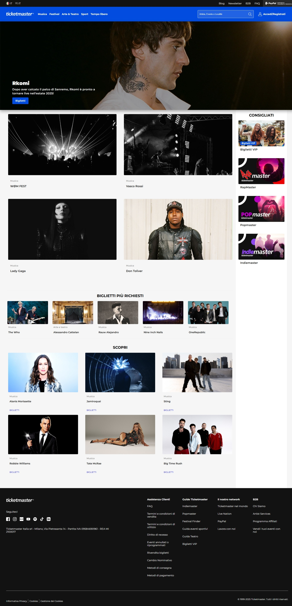
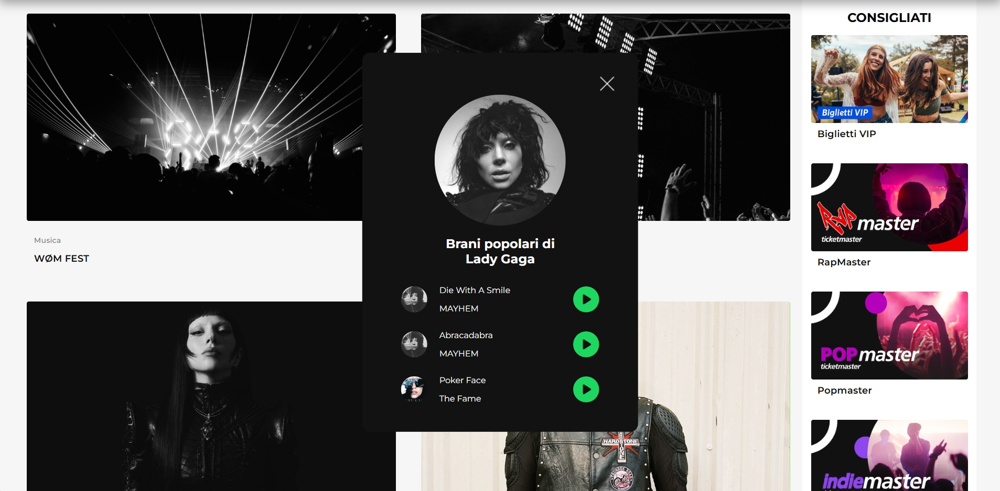
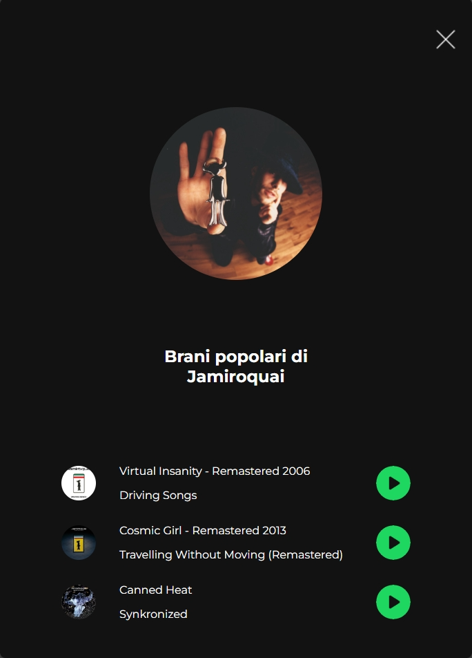

# MiniHomework 3
Consegna del terzo minihomework di Web Programming.

Similmente per quanto fatto lo scorso homework, ho separato il contenuto del file .js in dei file separati in vista dell'implementazione di altre pagine.

Inoltre, ho messo le api keys in un file ```keys.txt```, recuperato con fetch, il cui contenuto è questo:

```
CHIAVE_TICKETMASTER
CHIAVE_CLIENT_SPOTIFY
CHIAVE_SEGRETA_SPOTIFY
```

La API di Ticketmaster è stata utilizzata per recuperare gli eventi del momento e generare le carte della homepage in maniera dinamica. Vengono presi gli ultimi eventi in Italia inseriti nel backend di Ticketmaster.

La API di Spotify è stata utilizzata per trovare i brani più famosi dell'artista selezionato se l'evento è della tipologia 'Musica'.

I dati sono utilizzati per creare un box che recupera l'immagine dell'artista da Spotify, mostra i 3 brani più popolari e anche l'album di appartenenza, oltre a fornire un pulsante "play" che reindirizza direttamente alla canzone su Spotify.

# Screenshots

## Carte create dinamicamente da Ticketmaster
<details>
    <summary>Apri Immagine</summary>
    
</details>

## Box di Spotify
<details>
    <summary>Apri Immagine</summary>
    
</details>

## Box di Spotify layout Mobile
<details>
    <summary>Apri Immagine</summary>
    
</details>